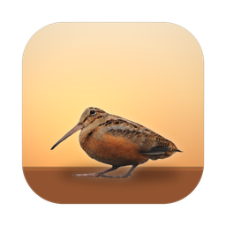
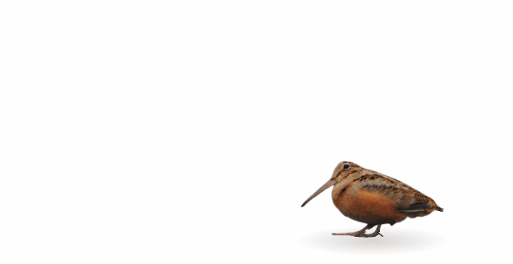
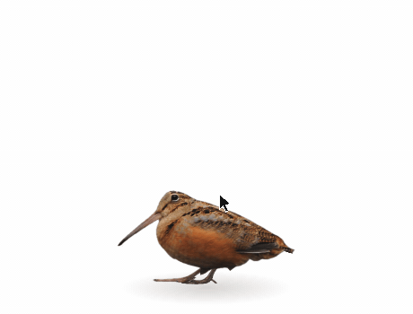
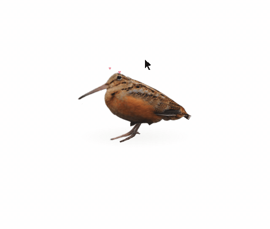
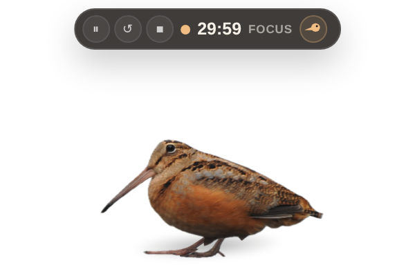

<p align="center">
  
</p>

<h1 align="center">Take a Meep</h1>

<p align="center">
  <em>一只住在你 Mac 右下角的<b>实拍丘鹬</b>：替你掐番茄钟，<br/>
  到点仰头 <b>meep meep</b> 两声，提醒你该休息了。</em>
</p>

<p align="center">
  <a href="./README.md">English</a> · <b>中文</b>
</p>

<p align="center">
  
</p>

<p align="center"><sub>
  每一根羽毛都来自同一张 USFWS 公共领域实拍照片，重新拼成 12 图层的提线木偶；<br/>
  "慢走几步、停下来前后摇摆"的步态，是逐帧对照真实丘鹬影像还原的。
</sub></p>

## 下载

**[⬇️ 下载 Take a Meep（macOS · Apple Silicon）](https://github.com/MengQiuchen/take-a-meep/releases/latest)** —— 下载 `.dmg`，把鸟拖进「应用程序」就装好了。

> **首次打开**：应用只有本机 ad-hoc 签名（暂无 Apple 公证），macOS 会拦一下。
> 去 **系统设置 → 隐私与安全性**，拉到底点 **仍要打开**；或在终端跑一次
> `xattr -cr "/Applications/Take a Meep.app"`。之后就能正常打开了。

## 见见这只鸟

<table>
  <tr>
    <td align="center" width="50%">
      <br/>
      <b>它会叫。</b>专注结束就仰头张大嘴，<i>meep meep!</i>
      三个降噪叫声变体随机播放、不连续重复，听起来不像循环采样。
    </td>
    <td align="center" width="50%">
      <br/>
      <b>它喜欢被摸。</b>来回摩擦羽毛 → 眯眼、蓬起胸毛、头顶冒小爱心；
      一直摸下去，它会开心得叫出声。
    </td>
  </tr>
  <tr>
    <td align="center">
      <br/>
      <b>它可以被拎走。</b>随手拎到屏幕任何地方，两腿悬空抗议乱蹬；
      从高处松手，它会一路扑棱翅膀减速落地。
    </td>
    <td align="center">
      <br/>
      <b>时间牌像气泡一样悬在头顶。</b>悬停浮现、单击钉住：
      ⏸ ↺ ■ 三颗小圆钮，尾端还有一颗点了就叫的小鸟头按钮。
    </td>
  </tr>
</table>

## 它会做什么

- 🍅 **鸟形番茄钟** — 双击开始：专注 30 分钟 + 休息 5 分钟循环往复（时长可改）。
- 🚶 **休息散步毫秒级准点** — 整段休息是一次"走出去再走回来"，准时准点回到出发位置。休息久：路上多摇摆、折返点更远、远端觅食；休息短：少摇摆、走近一点。
- 🧘 **专注就是专注** — 计时和暂停期间绝不出门乱跑，只理毛、啄地、环顾四周，安静 4 分钟就打盹。
- 🐛 **好奇心重** — 鼠标停在它嘴前不动，它会伸长脖子好奇地啄一下。
- ☰ **所有设置都在菜单栏** — 计时状态与控制、专注/休息时长、空闲散步、静音、**鸟的大小和透明度**、语言（EN / 中文）。没有任何窗口和面板。
- 🪶 **真羽毛、真物理** — 照片切片的 2.5D 木偶：可伸缩的脖子、两段式 IK 腿、扇形尾羽；有重力、弹跳，摔下来会扑棱翅膀。

## 跑起来

macOS（Apple Silicon）+ Node 20+：

```bash
npm install
npm start            # 直接运行
npm run package:mac  # 打包 "Take a Meep.app"（本机 ad-hoc 签名，输出到 dist/）
```

或者直接双击 **`build-and-install.command`** —— 一键打包、装到桌面并启动。

## 操作速查

| 你 | 鸟 |
|---|---|
| 双击 | 开始 / 暂停循环计时 |
| 悬停 | 时间牌浮现 |
| 单击 | 钉住 / 收起时间牌（附赠歪头） |
| 来回摩擦 | 蓬毛冒爱心；摸久了开心大叫 |
| 按住拖动 | 被拎走，两腿乱蹬 |
| 高处松手 | 扑棱翅膀减速，落地蹲一下 |
| 鼠标停在嘴前 | 好奇一啄 |
| 菜单栏小鸟 | 所有设置，一层菜单 |

## 怎么做的

这只鸟是一个**照片驱动的 2.5D 木偶**：12 个图层（头骨、可伸缩的脖子、身体、近侧翅膀、上下喙、两条带可伸缩跗跖的腿、扇形尾羽、眼睑）全部从同一张 USFWS 公共领域照片上切下来，用一个带两段式腿部 IK 的小骨架驱动。步态数字——体长 13% 的前后摇摆、85% 的头部跟随、只在前冲段迈步——来自对 USFWS 行走影像的相机补偿逐帧追踪。整个应用就是一个透明置顶的 Electron 窗口加一个菜单栏菜单。

完整技术细节（图层怎么切、步态怎么测、散步怎么按休息时长编排）见 **[docs/DEVELOPMENT.md](docs/DEVELOPMENT.md)**。

## 素材与许可

- **丘鹬照片**：Tiffany Vanwyck / 美国鱼类及野生动物管理局（USFWS）——公共领域。**行走影像**（步态参考）：Keith Ramos / USFWS。详见 [`assets/ATTRIBUTION.md`](assets/ATTRIBUTION.md)。
- **叫声音频**：项目作者自己录制，经降噪重制；请勿单独二次分发。
- **行为参考**：Frontiers in Zoology (2014) 鸟类点头与步态研究；观鸟者对丘鹬摇摆行走的记录。
- **代码**：[MIT](LICENSE)。原始视频素材与中间帧文件刻意未纳入本仓库。

<p align="center"><sub>🐦 <i>记得休息。</i></sub></p>
